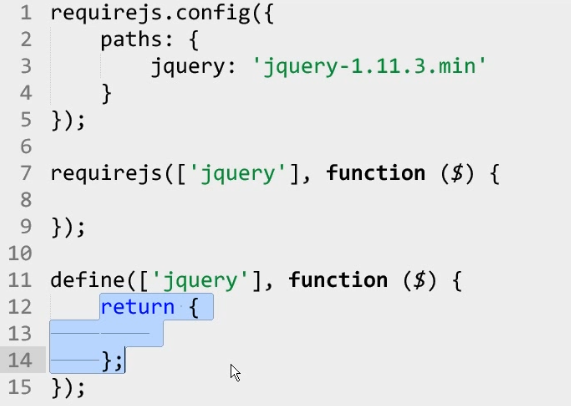
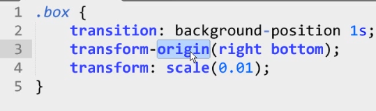

### SASS
	1、嵌套
	2、$变量
	3、@mixin 函数名（参数）
	4、@import 
	5、@extend 复制

### RequireJS
	1、requirejs.config    取别名
	2、requirejs   引入
	3、define 定义插件，封装

### CSS3 动画效果
	1、过度效果transition
	2、2D变换transform

### CSS精灵、图标字体和伪类
	1、将多张图片合并成一张，雪碧图，减少http请求
	2、替代简单图片，方便修改
	3、减少标签的书写，降低html结构的复杂性
